# Wecord — 시스템 아키텍처 문서 (ARCHITECTURE.md)

> 버전: 2.0  
> 작성일: 2026-03-11  
> 최종 수정: 2026-03-12 (MVP 스코프 회의 반영)  
> 기반: Weverse 기술 아키텍처 분석 + 프로젝트 요구사항  
> 설계 철학: **Just Use Postgres** + **솔로 개발자 현실주의**

---

## 1. 시스템 개요

### 1.1 아키텍처 다이어그램

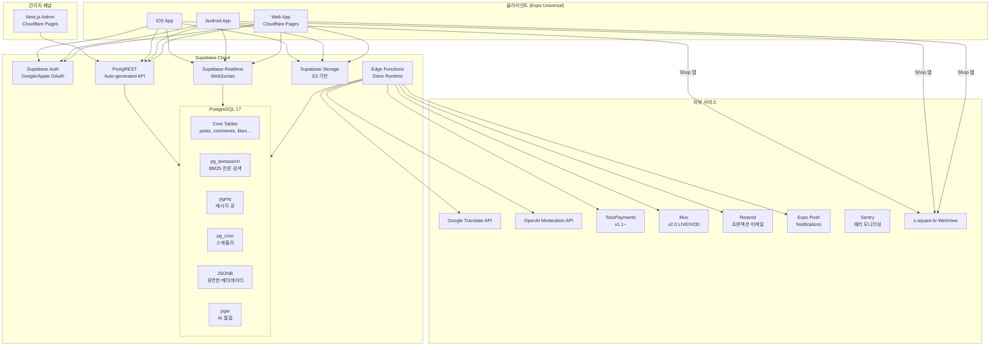

### 1.2 설계 원칙

| 원칙 | 설명 | 근거 |
|------|------|------|
| **Just Use Postgres** | 가능한 모든 것을 PostgreSQL로 해결 | 검색(pg_textsearch), 큐(pgmq), 스케줄링(pg_cron), JSON(JSONB), AI(pgai) — 외부 서비스 의존도 최소화 |
| **Supabase 올인원** | 인증, API, Realtime, Storage를 단일 플랫폼에서 | 솔로 개발자가 관리해야 할 인프라 최소화 |
| **모놀리식 DB, 도메인 분리** | 단일 PostgreSQL이지만 스키마/RLS로 도메인 분리 | [Weverse 참조] 마이크로서비스는 팀 규모가 커진 후 고려 |
| **RLS 퍼스트** | 모든 데이터 접근은 PostgreSQL RLS로 제어 | 서버 코드 없이도 권한 관리 가능 |
| **Edge Function 최소화** | 외부 API 호출, 복잡한 비즈니스 로직만 Edge Function | PostgREST + RLS로 대부분 처리 |
| **Expo Universal** | iOS/Android/Web 단일 코드베이스 | 솔로 개발자의 멀티 플랫폼 효율 극대화 |

### 1.3 Weverse vs Wecord 아키텍처 비교

[Weverse tech-architecture.md §11 참조]

| 영역 | Weverse (엔터프라이즈) | Wecord (스타트업/MVP) |
|------|----------------------|---------------------|
| 백엔드 | Java/Spring 마이크로서비스 10+ | Supabase (PostgREST + Edge Functions) |
| DB | PostgreSQL + MySQL + Oracle | PostgreSQL 17 단일 (Just Use Postgres) |
| 이벤트 버스 | Kafka | pgmq (PostgreSQL 네이티브 큐) |
| 검색 | Elasticsearch [추정] | pg_textsearch (BM25) |
| 캐시 | Redis | PostgreSQL (Materialized View + JSONB) |
| 큐 | Kafka | pgmq |
| 인증 | 자체 HMAC + OAuth | Supabase Auth (JWT + OAuth) |
| API Gateway | Naver Cloud API Gateway | Supabase PostgREST (자동 생성) |
| 클라우드 | AWS + Naver Cloud (듀얼) | Supabase Cloud + Cloudflare |
| 프론트엔드 | React (웹) + React Native (앱) | Expo (React Native Universal) |
| 스케일링 | 수천만 동시접속 | 수만 동시접속 (단계적 확장) |

---

## 2. 기술 스택 상세

### 2.1 프론트엔드

| 기술 | 버전 | 선택 근거 |
|------|------|-----------|
| **Expo** | SDK 55 | iOS/Android/Web 단일 코드베이스, OTA 업데이트, EAS Build로 CI/CD 통합 |
| **expo-router** | v4+ | 파일 기반 라우팅, 딥링크 자동 처리, 웹 SEO 지원 |
| **React Native** | 0.76+ (New Architecture) | Expo SDK 55의 기본 RN 버전, Fabric/TurboModules 활성화 |
| **TanStack Query** | v5 | 서버 상태 관리, 자동 캐싱/리페칭, Supabase와 궁합 최적 |
| **Zustand** | v5 | 클라이언트 상태 관리 (인증 상태, UI 상태), 경량/직관적 |
| **i18next** + **expo-localization** | - | 5개 언어 UI 국제화 |
| **FlashList** | v2 | 대량 피드 가상화 리스트, FlatList 대비 5x 성능 |
| **Nativewind** | v4 | Tailwind CSS 기반 스타일링, 웹/네이티브 통합 |
| **react-native-webview** | - | Shop 탭 인앱 WebView (x-square.kr) |

### 2.2 백엔드 (Supabase)

| 기술 | 용도 | 선택 근거 |
|------|------|-----------|
| **Supabase Auth** | 인증/인가 | Google/Apple OAuth, JWT, RLS 통합, 자체 인증 구축 비용 제거 |
| **PostgREST** | REST API 자동 생성 | CRUD API 코드 작성 불필요, 스키마 변경 즉시 반영 |
| **Supabase Realtime** | WebSocket | 실시간 피드 업데이트, 알림 배지, v2.0 LIVE 채팅 |
| **Supabase Storage** | 파일 저장 | S3 호환, Signed URL, 이미지 변환(transform) 내장 |
| **Edge Functions** | 서버리스 함수 | Deno 런타임, 외부 API 호출, 복잡한 비즈니스 로직 |

### 2.3 데이터베이스 (PostgreSQL 17 — Just Use Postgres)

| 확장/기능 | 용도 | 대체하는 외부 서비스 |
|-----------|------|---------------------|
| **pg_textsearch** (BM25) | 전문 검색 (게시글, 커뮤니티) | Elasticsearch |
| **pgmq** | 메시지 큐 (알림 fan-out, 비동기 작업) | Kafka, RabbitMQ, SQS |
| **pg_cron** | 스케줄링 (예약 게시, 구독 결제, 만료 처리) | 외부 cron, CloudWatch Events |
| **JSONB** | 유연한 메타데이터 (설정, 번역 캐시) | MongoDB |
| **pgai** | AI 통합 (임베딩 생성, 유사도 검색) | 별도 AI 파이프라인 |
| **pgvector** + **pgvectorscale** | 벡터 검색 (v2.0 추천 시스템) | Pinecone |
| **pg_trgm** | 퍼지 검색 (자동완성, 오타 허용) | Algolia |
| **GIN/GiST 인덱스** | 전문 검색/JSONB 인덱싱 | 별도 인덱싱 서비스 |
| **Materialized View** | 캐싱 (대시보드 집계, 인기글 순위) | Redis |
| **pg_notify** | Realtime 이벤트 트리거 | 별도 Pub/Sub |

### 2.4 ORM & 데이터 접근

| 기술 | 용도 | 선택 근거 |
|------|------|-----------|
| **Drizzle ORM** | 타입 안전 DB 접근 | TypeScript 네이티브, SQL에 가까운 API, Supabase PostgreSQL 완벽 호환, Prisma 대비 경량 |
| **Supabase JS Client** | 클라이언트 DB 접근 | PostgREST + Realtime + Storage + Auth 통합 SDK |
| **Drizzle Kit** | 마이그레이션 | 스키마 diff 기반 자동 마이그레이션 생성 |

### 2.5 외부 서비스

| 서비스 | 용도 | Phase | 비용 모델 |
|--------|------|-------|-----------|
| **Google Translate API** | 게시글/댓글 번역 | MVP | $20/1M 글자 |
| **OpenAI Moderation API** | 콘텐츠 자동 모더레이션 | MVP | 무료 (Moderation endpoint) |
| **Expo Push Notifications** | 푸시 알림 | MVP | 무료 |
| **Resend** | 트랜잭션 이메일 | MVP | 무료 (3,000/월) → $20/월 |
| **Sentry** | 에러 모니터링 | MVP | 무료 (5K 이벤트/월) |
| **TossPayments** | 결제 (IAP + 웹 결제) | v1.1 | 3.5% 수수료 |
| **Mux** | LIVE 스트리밍 + VOD | v2.0 | 분당 과금 |

### 2.6 인프라 & 배포

| 기술 | 용도 | 선택 근거 |
|------|------|-----------|
| **Cloudflare Pages** | 웹앱 + 관리자 대시보드 배포 | 무료 tier 충분, 글로벌 CDN, GitHub 연동 |
| **EAS Build** | iOS/Android 앱 빌드 | Expo 공식 빌드 서비스, 로컬 빌드 환경 불필요 |
| **EAS Update** | OTA 업데이트 | 앱스토어 심사 없이 JS 번들 업데이트 |
| **GitHub Actions** | CI/CD | 린트/테스트/빌드/배포 자동화, Turborepo 캐시 연동 |

---

## 3. 모노레포 구조

### 3.1 Turborepo 구조

```
wecord/
├── apps/
│   ├── mobile/                    # Expo Universal (iOS/Android/Web)
│   │   ├── app/                   # expo-router 파일 기반 라우팅
│   │   │   ├── (auth)/            # 인증 관련 화면
│   │   │   │   ├── login.tsx
│   │   │   │   ├── register.tsx
│   │   │   │   └── onboarding.tsx
│   │   │   ├── (tabs)/            # 메인 탭 레이아웃 (4탭)
│   │   │   │   ├── index.tsx      # 홈 (통합 피드 / 추천)
│   │   │   │   ├── shop.tsx       # Shop (WebView)
│   │   │   │   ├── dm.tsx         # DM (플레이스홀더)
│   │   │   │   └── more.tsx       # 더보기 (계정 허브)
│   │   │   ├── community/
│   │   │   │   └── [slug]/
│   │   │   │       ├── index.tsx      # Highlight 탭
│   │   │   │       ├── fan.tsx        # Fan 피드
│   │   │   │       ├── creator.tsx    # Creator 피드
│   │   │   │       ├── notice.tsx     # 공지사항
│   │   │   │       ├── members.tsx    # 멤버 리스트
│   │   │   │       └── join.tsx       # 가입 (닉네임 설정)
│   │   │   ├── member/
│   │   │   │   └── [memberId].tsx     # 아티스트 멤버 프로필/게시글
│   │   │   ├── profile/
│   │   │   │   └── [cmId].tsx         # 커뮤니티 프로필
│   │   │   └── _layout.tsx
│   │   ├── components/
│   │   ├── hooks/
│   │   ├── app.json
│   │   ├── metro.config.js
│   │   └── package.json
│   │
│   └── admin/                     # Next.js 관리자 대시보드
│       ├── app/
│       │   ├── dashboard/
│       │   ├── communities/
│       │   ├── users/
│       │   ├── moderation/
│       │   ├── notices/
│       │   └── settings/
│       ├── components/
│       └── package.json
│
├── packages/
│   ├── db/                        # Drizzle ORM 스키마 & 마이그레이션
│   │   ├── schema/
│   │   │   ├── auth.ts            # users, profiles
│   │   │   ├── community.ts       # communities, community_members
│   │   │   ├── artist-member.ts   # artist_members
│   │   │   ├── follow.ts          # community_follows
│   │   │   ├── content.ts         # posts, comments, likes
│   │   │   ├── notification.ts    # notifications, preferences
│   │   │   ├── moderation.ts      # reports, sanctions
│   │   │   ├── translation.ts     # post_translations
│   │   │   ├── dm.ts              # dm_subscriptions, dm_messages (v1.1)
│   │   │   ├── commerce.ts        # jelly, memberships (v1.1)
│   │   │   └── media.ts           # media_contents (v1.1)
│   │   ├── migrations/
│   │   ├── seed.ts
│   │   ├── drizzle.config.ts
│   │   └── package.json
│   │
│   ├── supabase/                  # Supabase 설정
│   │   ├── functions/             # Edge Functions
│   │   │   ├── translate/         # Google Translate 호출
│   │   │   ├── moderate/          # OpenAI Moderation 호출
│   │   │   ├── notify/            # Push 알림 fan-out (팔로잉 필터 포함)
│   │   │   ├── aggregate/         # Highlight 탭 집계
│   │   │   ├── home-feed/         # 통합 홈 피드
│   │   │   ├── generate-nickname/ # 랜덤 코드닉 생성
│   │   │   └── email/             # Resend 이메일 발송
│   │   ├── migrations/            # Supabase SQL 마이그레이션
│   │   ├── seed.sql
│   │   └── config.toml
│   │
│   ├── shared/                    # 공유 유틸리티
│   │   ├── types/                 # TypeScript 타입 정의
│   │   ├── constants/             # 상수 (언어 코드, 역할 등)
│   │   ├── validators/            # Zod 스키마 (입력 검증)
│   │   ├── i18n/                  # 번역 리소스 (KO/EN/TH/ZH/JA)
│   │   │   ├── ko.json
│   │   │   ├── en.json
│   │   │   ├── th.json
│   │   │   ├── zh.json
│   │   │   └── ja.json
│   │   └── package.json
│   │
│   └── ui/                        # 공유 UI 컴포넌트 (선택적)
│       ├── components/
│       └── package.json
│
├── tooling/
│   ├── eslint/                    # ESLint 설정
│   ├── typescript/                # tsconfig 베이스
│   └── prettier/                  # Prettier 설정
│
├── turbo.json
├── package.json
├── pnpm-workspace.yaml
├── CLAUDE.md                      # Claude Code 설정
└── README.md
```

### 3.2 패키지 의존성 그래프

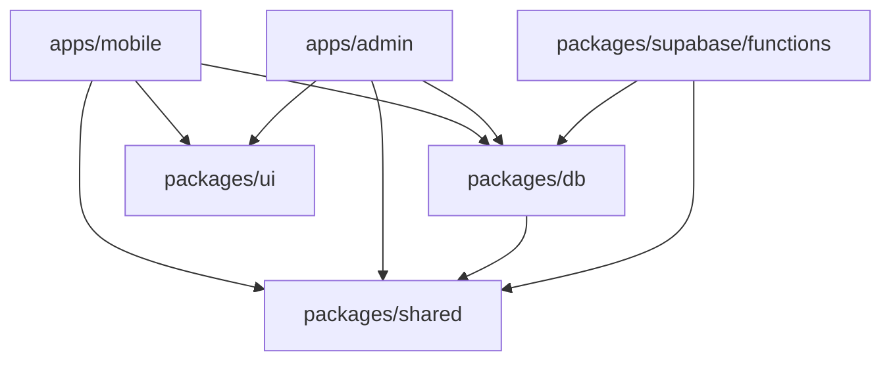

---

## 4. 데이터 모델

### 4.1 ERD (핵심 테이블)

<!-- 회의 반영 2026-03-12: 이중 계정 + 멤버 시스템 + 팔로잉 -->

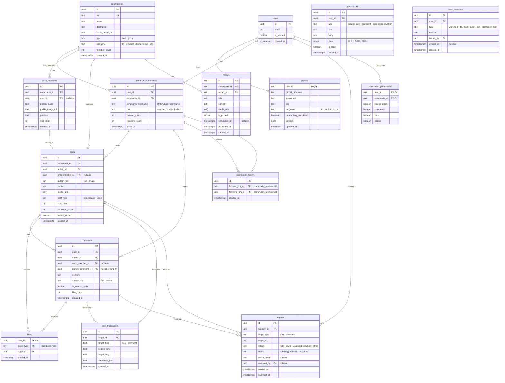

### 4.2 v1.1 추가 테이블 (수익화)

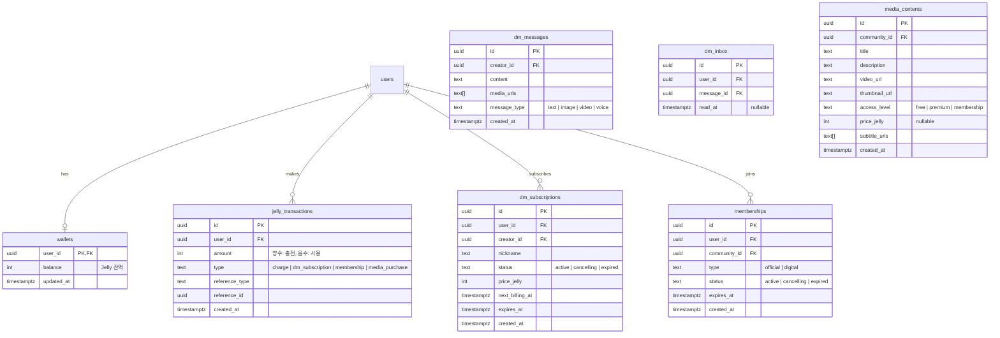

### 4.3 닉네임 표시 뷰

<!-- 회의 반영 2026-03-12: 이중 계정 JOIN 추상화 -->

```sql
CREATE VIEW posts_with_nickname AS
SELECT p.*, cm.community_nickname AS author_nickname, cm.id AS author_cm_id,
       am.display_name AS artist_member_name, c.name AS community_name, c.slug AS community_slug
FROM posts p
JOIN community_members cm ON cm.user_id = p.author_id AND cm.community_id = p.community_id
LEFT JOIN artist_members am ON am.id = p.artist_member_id
JOIN communities c ON c.id = p.community_id;
```

### 4.4 주요 인덱스 전략

```sql
-- 전문 검색 (BM25)
CREATE INDEX idx_posts_search ON posts USING GIN(search_vector);
CREATE INDEX idx_communities_search ON communities USING GIN(to_tsvector('simple', name || ' ' || description));

-- 피드 페이지네이션 (cursor 기반)
CREATE INDEX idx_posts_feed ON posts(community_id, created_at DESC, id DESC);
CREATE INDEX idx_posts_creator ON posts(community_id, author_role, created_at DESC) WHERE author_role = 'creator';

-- 댓글
CREATE INDEX idx_comments_post ON comments(post_id, created_at ASC);
CREATE INDEX idx_comments_parent ON comments(parent_comment_id) WHERE parent_comment_id IS NOT NULL;

-- 좋아요 (중복 방지 + 빠른 조회)
-- likes 테이블의 PK가 (user_id, target_type, target_id)로 이미 인덱스됨

-- 번역 캐시 조회
CREATE UNIQUE INDEX idx_translations_lookup ON post_translations(target_id, target_type, target_lang);

-- 알림 (미읽은 알림 빠른 조회)
CREATE INDEX idx_notifications_unread ON notifications(user_id, created_at DESC) WHERE is_read = false;

-- 신고 (대기 중 신고 빠른 조회)
CREATE INDEX idx_reports_pending ON reports(created_at ASC) WHERE status = 'pending';

-- v2 신규: 이중 계정 + 멤버 시스템 + 팔로잉
CREATE UNIQUE INDEX idx_cm_nickname ON community_members(community_id, community_nickname);
CREATE UNIQUE INDEX idx_cm_user_community ON community_members(user_id, community_id);
CREATE INDEX idx_posts_member ON posts(artist_member_id, created_at DESC) WHERE artist_member_id IS NOT NULL;
CREATE INDEX idx_posts_home_feed ON posts(created_at DESC, id DESC);
CREATE UNIQUE INDEX idx_follows_unique ON community_follows(follower_cm_id, following_cm_id);
CREATE INDEX idx_follows_follower ON community_follows(follower_cm_id);
CREATE INDEX idx_follows_following ON community_follows(following_cm_id);
CREATE INDEX idx_artist_members_community ON artist_members(community_id, sort_order);
```

---

## 5. API 설계

### 5.1 API 접근 전략

Wecord의 API는 2가지 레이어로 구성된다:

1. **PostgREST (자동 생성 REST API)**: 단순 CRUD — 게시글 목록, 댓글 작성, 좋아요 토글 등
2. **Edge Functions (커스텀 API)**: 복잡한 비즈니스 로직 — 번역, 모더레이션, fan-out 알림, 집계

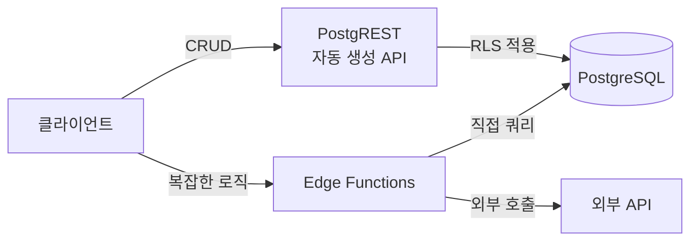

### 5.2 PostgREST 엔드포인트 (자동 생성)

| 리소스 | 메서드 | 설명 | RLS 정책 |
|--------|--------|------|----------|
| `/rest/v1/communities` | GET | 커뮤니티 목록/검색 | 전체 공개 |
| `/rest/v1/community_members` | POST/PATCH/DELETE | 커뮤니티 가입 (community_nickname 필수) / 닉네임 변경 / 탈퇴 | 본인만 |
| `/rest/v1/artist_members` | GET | 아티스트 멤버 목록 | 커뮤니티 멤버만 |
| `/rest/v1/community_follows` | POST/DELETE | 팔로잉 토글 | 같은 커뮤니티 멤버만 |
| `/rest/v1/posts_with_nickname` | GET | 게시글+닉네임 뷰 | 커뮤니티 멤버만 열람 |
| `/rest/v1/posts` | GET/POST/DELETE | 게시글 CRUD | 커뮤니티 멤버만 열람, 본인 글 삭제 |
| `/rest/v1/comments` | GET/POST/DELETE | 댓글 CRUD | 커뮤니티 멤버만 |
| `/rest/v1/likes` | POST/DELETE | 좋아요 토글 | 커뮤니티 멤버만 |
| `/rest/v1/notices` | GET | 공지사항 열람 | 커뮤니티 멤버만 |
| `/rest/v1/notifications` | GET/PATCH | 알림 열람/읽음 처리 | 본인만 |
| `/rest/v1/profiles` | GET/PATCH | 글로벌 프로필 조회/수정 | 조회: 공개, 수정: 본인만 |
| `/rest/v1/reports` | POST | 신고 제출 | 로그인 유저 |

### 5.3 Edge Function 엔드포인트 (커스텀)

| 경로 | 메서드 | 설명 | 트리거 |
|------|--------|------|--------|
| `/functions/v1/translate` | POST | 게시글/댓글 번역 | 사용자 번역 버튼 탭 |
| `/functions/v1/moderate` | POST | 콘텐츠 모더레이션 검사 | 게시글/댓글 작성 시 자동 |
| `/functions/v1/notify` | POST | Push 알림 fan-out (팔로잉 필터 포함) | 크리에이터 게시글, 공지 등록 시 |
| `/functions/v1/highlight` | GET | Highlight 탭 집계 데이터 | Highlight 탭 진입 |
| `/functions/v1/home-feed` | GET | 통합 홈 피드 | 홈 탭 진입 |
| `/functions/v1/generate-nickname` | POST | 랜덤 코드닉 생성 | 커뮤니티 가입 시 |
| `/functions/v1/send-email` | POST | 트랜잭션 이메일 | 회원가입 환영, 신고 처리 결과 등 |

### 5.4 Edge Function 상세: translate

```typescript
// packages/supabase/functions/translate/index.ts
import { serve } from "https://deno.land/std/http/server.ts";
import { createClient } from "https://esm.sh/@supabase/supabase-js";

serve(async (req) => {
  const { target_id, target_type, target_lang } = await req.json();
  const supabase = createClient(/* ... */);
  
  // 1. 캐시 확인
  const { data: cached } = await supabase
    .from("post_translations")
    .select("translated_text")
    .eq("target_id", target_id)
    .eq("target_type", target_type)
    .eq("target_lang", target_lang)
    .single();
  
  if (cached) return new Response(JSON.stringify(cached));
  
  // 2. 원문 조회
  const { data: original } = await supabase
    .from(target_type === "post" ? "posts" : "comments")
    .select("content")
    .eq("id", target_id)
    .single();
  
  // 3. Google Translate API 호출
  const translated = await fetch(
    `https://translation.googleapis.com/language/translate/v2`,
    { /* ... */ }
  );
  
  // 4. 캐시 저장
  await supabase.from("post_translations").insert({
    target_id, target_type, target_lang,
    source_lang: detected_lang,
    translated_text: translated.text,
  });
  
  return new Response(JSON.stringify({ translated_text: translated.text }));
});
```

### 5.5 Edge Function 상세: notify (fan-out)

[Weverse 비즈니스 로직 §6.3 Fan-out 패턴 참조]

```typescript
// packages/supabase/functions/notify/index.ts
serve(async (req) => {
  const { event_type, community_id, data } = await req.json();
  
  // 1. 대상자 조회 (알림 설정 ON인 멤버만)
  const { data: members } = await supabase.rpc("get_notify_targets", {
    p_community_id: community_id,
    p_event_type: event_type, // 'creator_post' | 'notice'
  });
  
  // 2. pgmq에 배치 작업 등록 (1000명씩)
  const batches = chunk(members, 1000);
  for (const batch of batches) {
    await supabase.rpc("pgmq_send", {
      queue_name: "push_notifications",
      message: JSON.stringify({
        tokens: batch.map(m => m.push_token),
        title: data.title,
        body: data.body,
        data: data.deep_link,
      }),
    });
  }
  
  // 3. 인앱 알림 벌크 INSERT
  await supabase.from("notifications").insert(
    members.map(m => ({
      user_id: m.user_id,
      type: event_type,
      title: data.title,
      body: data.body,
      data: data.deep_link,
    }))
  );
});
```

---

## 6. 인증/인가 아키텍처

### 6.1 이중 계정 인증 플로우

<!-- 회의 반영 2026-03-12: 이중 계정 플로우 -->

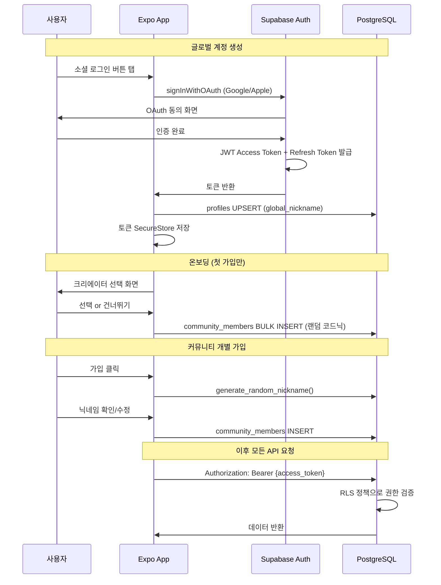

### 6.2 역할(Role) 체계

[Weverse 비즈니스 로직 §2.1 역할 정의 참조, Wecord에 맞게 조정]

| 역할 | 코드 | 설명 | 결정 방법 |
|------|------|------|-----------|
| 비로그인 | `anon` | 앱 설치 전/로그인 전 | JWT 없음 |
| 일반 유저 | `user` | 로그인 완료, 커뮤니티 미가입 | `auth.uid()` 존재 |
| 커뮤니티 멤버 | `member` | 해당 커뮤니티 가입 완료 | `community_members` 조인 확인 |
| 크리에이터 | `creator` | 크리에이터 계정 | `community_members.role = 'creator'` |
| 관리자 | `admin` | 운영팀 | `users.role = 'admin'` |

### 6.3 RLS 정책 예시

```sql
-- 게시글 열람: 커뮤니티 멤버만
CREATE POLICY "posts_select_member" ON posts FOR SELECT
USING (
  EXISTS (
    SELECT 1 FROM community_members
    WHERE community_members.community_id = posts.community_id
      AND community_members.user_id = auth.uid()
  )
);

-- 게시글 작성: 커뮤니티 멤버 + 닉네임 설정 완료
CREATE POLICY "posts_insert_member" ON posts FOR INSERT
WITH CHECK (
  auth.uid() = author_id
  AND EXISTS (
    SELECT 1 FROM community_members cm
    WHERE cm.community_id = posts.community_id
      AND cm.user_id = auth.uid()
      AND cm.community_nickname IS NOT NULL
  )
  AND (
    author_role = 'fan'
    OR (author_role = 'creator' AND EXISTS (
      SELECT 1 FROM community_members cm
      WHERE cm.community_id = posts.community_id
        AND cm.user_id = auth.uid()
        AND cm.role = 'creator'
    ))
  )
  -- 제재 유저 차단
  AND NOT EXISTS (
    SELECT 1 FROM user_sanctions us
    WHERE us.user_id = auth.uid()
      AND us.type != 'warning'
      AND (us.expires_at IS NULL OR us.expires_at > now())
  )
);

-- 좋아요: 중복 방지는 PK constraint, 멤버만
CREATE POLICY "likes_insert_member" ON likes FOR INSERT
WITH CHECK (
  auth.uid() = user_id
  AND EXISTS (
    SELECT 1 FROM posts p
    JOIN community_members cm ON cm.community_id = p.community_id
    WHERE p.id = likes.target_id
      AND cm.user_id = auth.uid()
  )
);

-- 관리자: 전체 접근
CREATE POLICY "admin_full_access" ON posts FOR ALL
USING (
  EXISTS (SELECT 1 FROM users WHERE id = auth.uid() AND role = 'admin')
);

-- 팔로잉: 같은 커뮤니티 내에서만
CREATE POLICY "follows_insert" ON community_follows FOR INSERT
WITH CHECK (
  EXISTS (
    SELECT 1 FROM community_members cm1
    JOIN community_members cm2 ON cm1.community_id = cm2.community_id
    WHERE cm1.id = community_follows.follower_cm_id
      AND cm2.id = community_follows.following_cm_id
      AND cm1.user_id = auth.uid()
  )
);
```

### 6.4 접근 권한 매트릭스 (MVP)

[Weverse 비즈니스 로직 §2.2 참조]

| 기능 | anon | user | member | creator | admin |
|------|------|------|--------|---------|-------|
| 커뮤니티 검색 | ✅ | ✅ | ✅ | ✅ | ✅ |
| 커뮤니티 가입 (닉네임) | ❌ | ✅ | - | - | ✅ |
| Fan 피드 열람 | ❌ | ❌ | ✅ | ✅ | ✅ |
| Fan 게시글 작성 | ❌ | ❌ | ✅ | ❌ | ✅ |
| Creator 피드 열람 | ❌ | ❌ | ✅ | ✅ | ✅ |
| Creator 게시글 작성 | ❌ | ❌ | ❌ | ✅ | ❌ |
| 멤버 리스트 | ❌ | ❌ | ✅ | ✅ | ✅ |
| 팔로잉 | ❌ | ❌ | ✅ | ✅ | ✅ |
| 닉네임 변경 | ❌ | ❌ | ✅(본인) | ✅(본인) | ✅ |
| 댓글/좋아요 | ❌ | ❌ | ✅ | ✅ | ✅ |
| 번역 | ❌ | ❌ | ✅ | ✅ | ✅ |
| 신고 | ❌ | ❌ | ✅ | ✅ | ✅ |
| 공지 열람 | ❌ | ❌ | ✅ | ✅ | ✅ |
| 공지 등록 | ❌ | ❌ | ❌ | ❌ | ✅ |
| 통합 홈 피드 | ❌ | ✅ | ✅ | ✅ | ✅ |
| Shop WebView | ✅ | ✅ | ✅ | ✅ | ✅ |
| 관리자 대시보드 | ❌ | ❌ | ❌ | ❌ | ✅ |
| 모더레이션 | ❌ | ❌ | ❌ | ❌ | ✅ |

---

## 7. 실시간 기능 아키텍처

### 7.1 MVP 실시간 기능

| 기능 | 기술 | 설명 |
|------|------|------|
| 새 게시글 알림 배지 | Supabase Realtime (Postgres Changes) | Fan/Creator 탭에 새 글 카운트 배지 |
| 좋아요 카운트 동기화 | Supabase Realtime (Broadcast) | 실시간 좋아요 수 업데이트 |
| 알림 뱃지 | Supabase Realtime (Postgres Changes) | 미읽은 알림 수 실시간 반영 |

### 7.2 Realtime 채널 설계

```typescript
// 커뮤니티 피드 실시간 업데이트
const feedChannel = supabase
  .channel(`community:${communityId}:posts`)
  .on('postgres_changes', {
    event: 'INSERT',
    schema: 'public',
    table: 'posts',
    filter: `community_id=eq.${communityId}`,
  }, (payload) => {
    // 새 글 카운트 배지 업데이트
    setNewPostCount(prev => prev + 1);
  })
  .subscribe();

// 알림 실시간 수신
const notifChannel = supabase
  .channel(`user:${userId}:notifications`)
  .on('postgres_changes', {
    event: 'INSERT',
    schema: 'public',
    table: 'notifications',
    filter: `user_id=eq.${userId}`,
  }, (payload) => {
    setUnreadCount(prev => prev + 1);
  })
  .subscribe();
```

### 7.3 v2.0 LIVE 실시간 아키텍처 (향후)

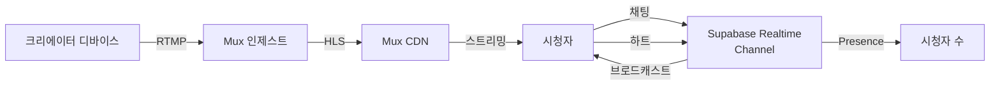

---

## 8. 미디어 파이프라인

### 8.1 MVP 미디어 (이미지/영상 업로드)

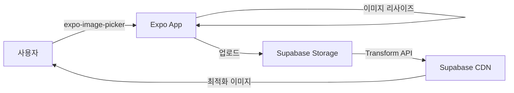

| 미디어 타입 | 제한 | 처리 |
|------------|------|------|
| 이미지 | 10장 × 5MB | 클라이언트 리사이즈 → Storage 업로드 → Transform API (썸네일 자동 생성) |
| 영상 | 1개 × 100MB | Storage 업로드 → 클라이언트 재생 (expo-av) |
| 프로필 이미지 | 1장 × 2MB | Storage avatars 버킷, 256×256 자동 리사이즈 |

### 8.2 v1.1 미디어 (VOD)

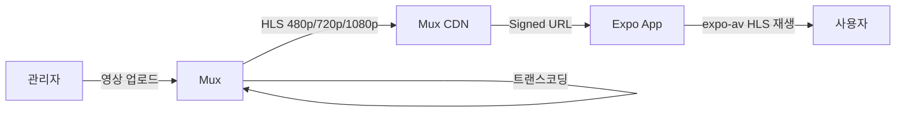

### 8.3 v2.0 미디어 (LIVE 스트리밍)

[Weverse tech-architecture.md §6.2 참조]

Mux Live Streaming을 활용하여 인제스트 → 트랜스코딩 → CDN → HLS 재생의 풀 파이프라인을 Mux에 위임한다. Supabase는 메타데이터(`live_streams` 테이블)와 채팅(Realtime Channel)만 관리한다.

---

## 9. 결제 플로우 (v1.1~)

### 9.1 Jelly 충전 플로우

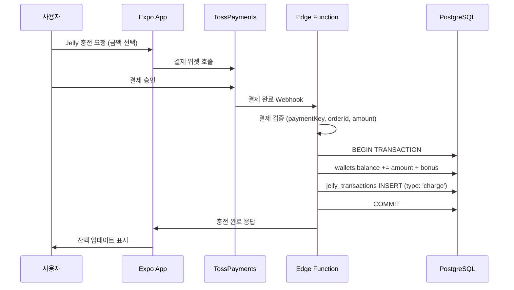

### 9.2 DM 구독 자동결제 (Jelly)

[Weverse 비즈니스 로직 §8.3 참조]

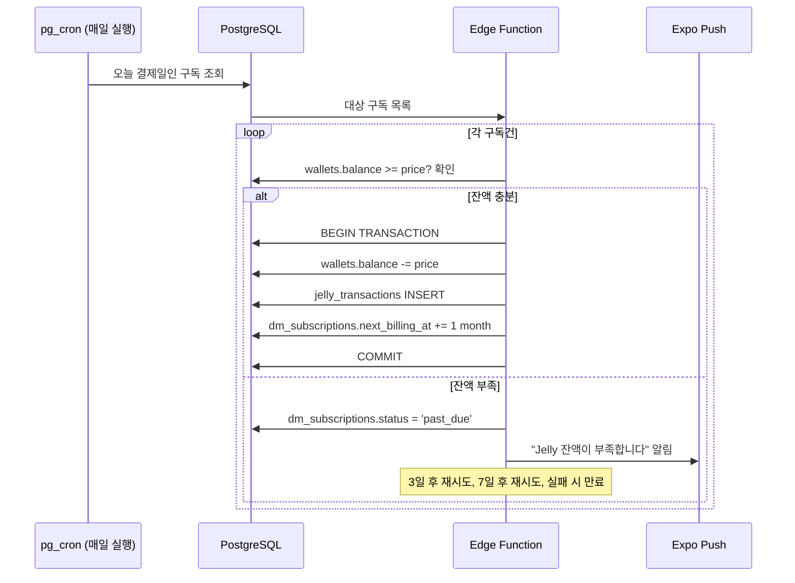

---

## 10. 배포 아키텍처

### 10.1 배포 파이프라인

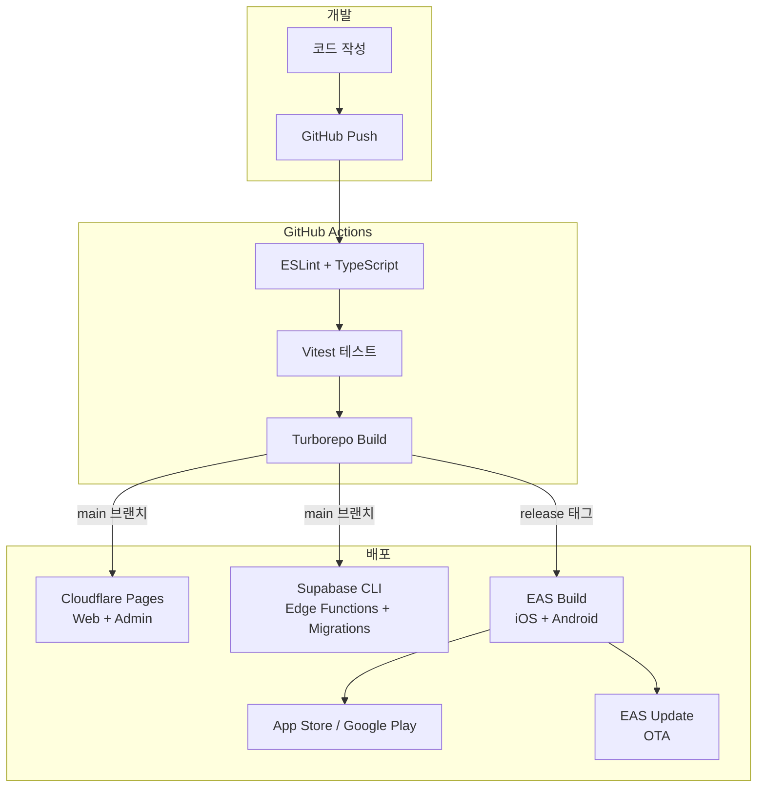

### 10.2 환경 구성

| 환경 | Supabase | 웹 배포 | 용도 |
|------|----------|---------|------|
| Local | Supabase Local (Docker) | localhost:3000 | 개발 |
| Preview | Supabase Branch (Preview) | Cloudflare Preview | PR 리뷰 |
| Production | Supabase Production | Cloudflare Production | 프로덕션 |

### 10.3 OTA 업데이트 전략

| 업데이트 유형 | 방법 | 앱스토어 심사 |
|-------------|------|-------------|
| JS 번들 변경 (UI, 로직) | EAS Update (OTA) | 불필요 |
| 네이티브 코드 변경 | EAS Build → 스토어 배포 | 필요 |
| 긴급 핫픽스 | EAS Update (즉시) | 불필요 |

---

## 11. 모니터링 & 로깅 전략

### 11.1 모니터링 스택

| 레이어 | 도구 | 모니터링 대상 |
|--------|------|-------------|
| 프론트엔드 에러 | **Sentry** (React Native) | JS 에러, 크래시, 성능 |
| API 에러 | **Sentry** (Edge Functions) | Edge Function 에러, 타임아웃 |
| DB 성능 | **Supabase Dashboard** | 쿼리 성능, 커넥션 풀, 스토리지 |
| 앱 분석 | **Supabase Analytics** + 커스텀 이벤트 | DAU/MAU, 피처 사용률 |
| 푸시 알림 | **Expo Push Dashboard** | 전달률, 오픈률 |
| 에러 알림 | **Sentry Alerts** → 슬랙 | P0 에러 즉시 알림 |

### 11.2 커스텀 이벤트 로깅

```typescript
// 주요 이벤트 (Supabase에 직접 로깅)
const events = {
  // 커뮤니티
  'community.join': { community_id, user_id },
  'community.leave': { community_id, user_id },
  
  // 콘텐츠
  'post.create': { post_id, community_id, type },
  'post.like': { post_id, user_id },
  'comment.create': { comment_id, post_id },
  
  // 번역
  'translate.request': { target_id, target_type, lang },
  'translate.cache_hit': { target_id, lang },
  
  // 알림
  'notification.sent': { count, type },
  'notification.opened': { notification_id },
};
```

---

## 12. 보안 고려사항

### 12.1 보안 레이어

[Weverse tech-architecture.md §5.3 참조]

```
[클라이언트]
├── HTTPS (TLS 1.3)
├── SecureStore (토큰 저장 — Expo)
├── 입력 검증 (Zod 스키마)
│
[Supabase]
├── JWT 검증 (모든 요청)
├── RLS (Row Level Security — 데이터 레벨 권한)
├── Rate Limiting (Edge Function)
│
[PostgreSQL]
├── RLS 정책 (모든 테이블)
├── Prepared Statement (SQL Injection 방지)
├── 암호화 (at-rest encryption)
│
[미디어]
├── Signed URL (만료 시간 설정)
├── 이미지 업로드 타입/크기 검증
└── Storage Bucket 정책
```

### 12.2 콘텐츠 모더레이션 파이프라인

[Weverse 비즈니스 로직 §7.1 참조]

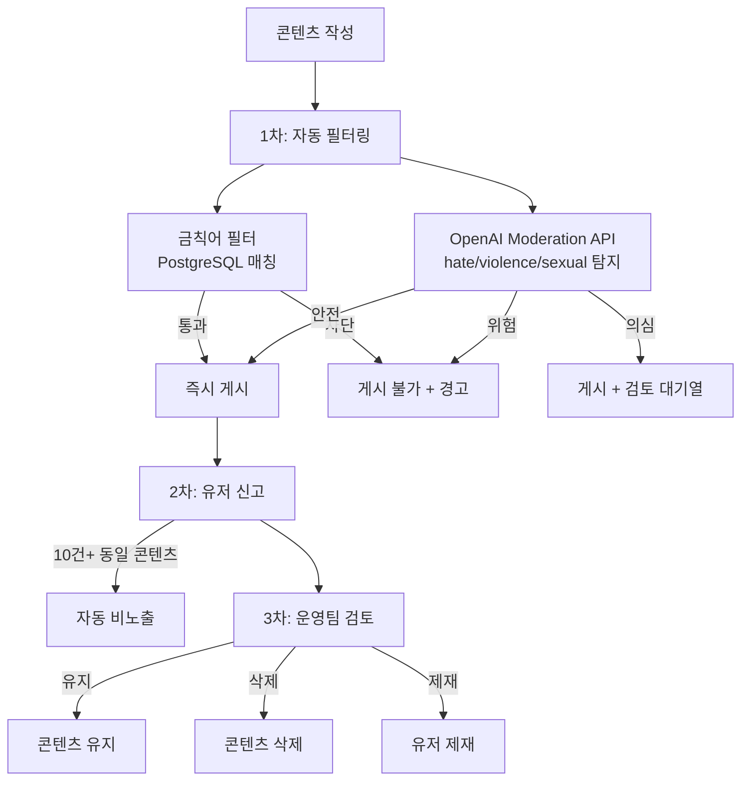

### 12.3 Rate Limiting 정책

| 엔드포인트 | 제한 | 대상 |
|-----------|------|------|
| 게시글 작성 | 5건/분 | 유저당 |
| 댓글 작성 | 10건/분 | 유저당 |
| 좋아요 | 30건/분 | 유저당 |
| 번역 요청 | 20건/분 | 유저당 |
| 검색 | 10건/분 | 유저당 |
| 로그인 시도 | 5건/15분 | IP당 |

---

## 13. 확장성 계획

### 13.1 단계별 확장 전략

| Phase | 규모 | 인프라 | 주요 변경 |
|-------|------|--------|-----------|
| **MVP** | 1K DAU, 10K 유저 | Supabase Pro Plan | 기본 설정 |
| **Growth** | 10K DAU, 100K 유저 | Supabase Team Plan | Read Replica 추가, Connection Pooling 튜닝 |
| **Scale** | 100K DAU, 1M 유저 | Supabase Enterprise | Dedicated Instance, 자체 인프라 부분 전환 검토 |

### 13.2 병목 예상 지점 & 대응

| 병목 | 예상 시점 | 대응 전략 |
|------|----------|-----------|
| DB 커넥션 | 동시 1K+ 요청 | Supavisor (Connection Pooler) 활용, 풀 사이즈 조정 |
| 알림 fan-out | 커뮤니티 10K+ 멤버 | pgmq 배치 + Edge Function 병렬 처리 |
| 번역 API 비용 | 일 10K+ 번역 요청 | 공격적 캐싱 (post_translations), 인기글 사전 번역 |
| Storage I/O | 일 10K+ 이미지 업로드 | 클라이언트 리사이즈 + CDN 캐싱 |
| Realtime 채널 | 동시 10K+ 구독 | 채널 분할 (커뮤니티별), Broadcast 모드 활용 |

### 13.3 PostgreSQL 스케일링 (Just Use Postgres 철학 유지)

```
Phase 1: 단일 인스턴스 최적화
├── 인덱스 튜닝
├── Materialized View (집계 캐싱)
├── VACUUM/ANALYZE 스케줄링 (pg_cron)
└── 쿼리 최적화 (EXPLAIN ANALYZE)

Phase 2: Read Replica
├── Supabase Read Replica 활성화
├── 읽기 부하 분산
└── 분석 쿼리 Replica로 분리

Phase 3: 파티셔닝
├── posts 테이블 시간 기반 파티셔닝
├── notifications 테이블 파티셔닝
└── 오래된 데이터 Cold Storage 이관
```

---

## 부록: 기술 선택 의사결정 기록 (ADR)

### ADR-001: Just Use Postgres (외부 서비스 최소화)

**맥락**: 솔로 개발자로서 관리해야 할 외부 서비스를 최소화해야 한다.

**결정**: PostgreSQL의 확장 기능으로 검색, 큐, 스케줄링, 캐싱을 모두 처리한다.

**결과**:
- pg_textsearch (BM25) → Elasticsearch 대체
- pgmq → Kafka/SQS 대체
- pg_cron → 외부 cron 대체
- JSONB → MongoDB 대체
- Materialized View → Redis 캐시 대체

**트레이드오프**: 대규모 트래픽에서 전용 서비스 대비 성능 열세 가능. Scale Phase에서 필요 시 개별 서비스 분리 검토.

### ADR-002: TossPayments 단독 (Stripe 제외)

**맥락**: 초기 타겟 시장이 한국/일본/태국/중국/영어권이며, 한국 결제 최적화가 우선.

**결정**: TossPayments만 사용. 글로벌 확장 시 Stripe 추가 검토.

**트레이드오프**: 해외 결제 경험이 TossPayments에서 제한적일 수 있으나, v1.1 단계에서 실제 해외 결제 수요를 검증한 후 Stripe 추가 결정.

### ADR-003: Expo Universal (네이티브 개발 제외)

**맥락**: 솔로 개발자가 iOS + Android + Web을 동시에 지원해야 한다.

**결정**: Expo SDK 55 Universal로 3개 플랫폼 단일 코드베이스 개발.

**트레이드오프**: 네이티브 전용 기능(NFC, 고급 카메라 등)에 제한이 있으나, 팬 커뮤니티 앱 특성상 해당 기능의 필요성이 낮음.

### ADR-004: 이중 계정 구조

<!-- 회의 반영 2026-03-12 -->

**맥락**: 팬들은 아티스트마다 다른 닉네임/정체성을 원한다. 글로벌 닉네임 하나로는 페르소나 분리가 불가능하다.

**결정**: `community_members.community_nickname`으로 커뮤니티별 닉네임 분리. `posts_with_nickname` 뷰로 JOIN 추상화. 글로벌 닉네임은 결제/설정용.

**결과**:
- 커뮤니티별 독립 프로필 (닉네임, 팔로워/팔로잉 수, 게시글)
- `posts_with_nickname` 뷰로 게시글 조회 시 자동 닉네임 JOIN
- 글로벌 프로필은 더보기 탭에서 관리

**트레이드오프**: JOIN 복잡도 ↑, 뷰로 대응. 닉네임 중복 검사 범위 = 커뮤니티별.

### ADR-005: community_follows 단일 테이블

<!-- 회의 반영 2026-03-12 -->

**맥락**: 팬→아티스트 팔로잉과 팬→팬 팔로잉을 별도 테이블로 분리할지, 통합할지 결정 필요.

**결정**: 팬→아티스트, 팬→팬 팔로잉을 `community_follows` 하나로 통합. 아티스트 멤버도 `community_members`의 일원. 같은 커뮤니티 내에서만 팔로잉 허용 (RLS 강제).

**결과**:
- 단일 테이블로 팔로잉 로직 단순화
- RLS로 커뮤니티 간 팔로잉 차단
- `follower_count`, `following_count`는 `community_members`에 비정규화

**트레이드오프**: 팬↔아티스트 팔로잉과 팬↔팬 팔로잉을 구분하려면 JOIN으로 role 확인 필요.
